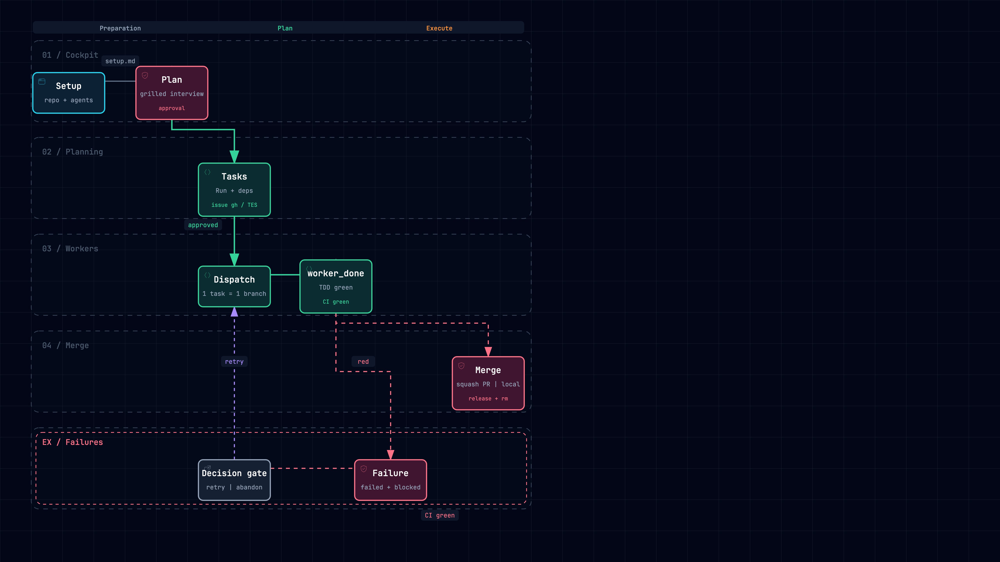

# orca-skills

Skills for orchestrating multi-agent work on [Orca](https://orca.sh): project setup, plan-first
brainstorm, plan-to-task cutting, the coordinator DAG runbook, durable project handoff/resume,
and the supervised worker + orchestrator agents. Built for **orchestrator sessions** (the
persistent cockpit worktree), usable from opencode and Claude Code.

The suite was validated end-to-end in real runs: a Linear-tracked project and a GitHub-tracked
project each went setup → plan → tasks → orchestrate → merge with green tests, linked issues,
and clean worktree teardown.

Install with a single command:

```bash
npx skills add adamelhirch/orca-skills
```

## Pipeline

```
/orca-setup  →  /orca-plan  →  /orca-tasks  →  /orca-orchestrate  →  /orca-handoff
(hookup)       (brainstorm)    (Run+Tasks)     (dispatch+DAG+merge)    (durable state)
                    └─────────────────────── /orca-resume in the next session
```

An interactive diagram of the pipeline (open in a browser) lives at
[`docs/diagrams/orca-pipeline.html`](docs/diagrams/orca-pipeline.html), with a PNG export
([`docs/diagrams/orca-pipeline.png`](docs/diagrams/orca-pipeline.png)):



The diagram shows the main path, the per-tracker mirror, and the failure gate.

## Skills

| Skill | Purpose |
| --- | --- |
| `/orca-setup` | Hook a project up to Orca orchestration: register the repo (new empty project or existing repo), create/link a GitHub repo when none exists (asking public/private), install the `worker` + `orchestrator` agent pairs, and record the tracker in `docs/agents/setup.md`. Replaces the old `/orca-worker`. |
| `/orca-plan` | Brainstorm a run with the user before any worker runs: grill the objective (design tree, rounds, recommendations), settle test seams and isolation per task, write `docs/agents/plan.md`, and get explicit approval. |
| `/orca-tasks` | Turn an approved plan into an Orca Run and its Tasks with `--deps` edges (1:1, stable ids), plus the tracker issue mirror. Creates the namespace only — never launches a worker. |
| `/orca-orchestrate` | Coordinator runbook: bind the Run, sweep `task-list --ready`, dispatch one-task-one-branch to `worker` terminals, watchdog `check --wait`, gate failures, merge green task branches, release workers. Quick path for 1-2 task runs. |
| `/orca-handoff` | Write a durable project handoff (Orca state + plan + session context) so a fresh orchestrator session resumes without losing context. |
| `/orca-resume` | Resume an Orca project: setup gate, load handoff + plan, reconcile with live Orca state, flag drift, re-anchor. |
| `/orca-freebuff` | Dispatch tasks to free (ad-funded) Freebuff coding agents as terminal-driven TUI workers — no headless mode exists, so the orchestrator injects the prompt, polls for a completion marker, and impersonates `worker_done` from the cockpit. |

## Prerequisites

- The Orca runtime running (`orca status`), with the `orca-cli` and `orchestration` skills
  installed — the skills load their version-matched command guides from the binary, never from
  this repo:
  ```bash
  orca skills install
  ```
- For Linear tracking, a Linear workspace connected in Orca settings + the native `orca linear`
  CLI. For GitHub tracking, an authenticated `gh` CLI and a remote.
- `/orca-setup` installs the agent pairs via `skills/orca-setup/install-agents.sh`: opencode
  `~/.config/opencode/agents/{worker,orchestrator}.md` and Claude Code
  `~/.claude/agents/{worker,orchestrator}.md`. Each is composed from a host header
  (`agents/<host>/<role>.md`, frontmatter + host permissions) plus the shared behaviour contract
  (`agents/_shared/<role>-contract.md`) — the lifecycle, TDD, and merge-gate rules exist once per
  role, not once per host.

## Usage

1. `/orca-setup` — register the repo and install the agent pairs. On a new empty project the
   setup asks about the GitHub remote (create public/private, link an existing repo, or stay
   local-only) and about the tracker.
2. `/orca-plan` — brainstorm and approve the plan.
3. `/orca-tasks` — cut the Run + Tasks + tracker issue mirror.
4. `/orca-orchestrate` — drive the run from the cockpit.
5. `/orca-handoff` at the end of a session, then `/orca-resume` in the next one.

The pipeline is a **gate chain**: `/orca-plan`, `/orca-tasks`, and `/orca-orchestrate` refuse to
run without `docs/agents/setup.md`, and `/orca-tasks` refuses a plan that is not `approved`. All
skills are user-invoked (`disable-model-invocation: true`) so they only fire when an orchestrator
calls them by name — never automatically in a worker session.

## Working model

- **Primary worktree = cockpit.** The orchestrator coordinates from the worktree tagged
  `isMainWorktree`, which stays on the default branch and receives merged work. Tasks never run
  in it.
- **One task = one branch = one worktree.** Tasks run in their own worktree/branch, never the
  primary worktree, unless the plan explicitly marks a task `isolated: no`.
- **TDD by default.** Workers write the failing test first at the plan's agreed seams, then the
  minimal implementation — one vertical slice at a time. No `worker_done succeeded` without
  green tests.
- **The merge gate is a capability, resolved at setup.** `/orca-setup` records one of
  `ci: github-actions`, `ci: local <command>`, or `ci: unverified` in `docs/agents/setup.md`, and
  that is what "verified" means for the project. This matters because the gate degrades silently
  otherwise: `gh pr checks` prints `no checks reported` and **exits 0** on a repo with no
  workflows, so a worker trusting the exit code reports success having run nothing. An empty
  check set is a failed gate, never a pass. The coordinator merges only work whose report names
  its evidence; the worker never merges.
- **Failures and stuck workers gate to the user.** A failed task is marked failed, its dependents
  blocked, and a decision gate is raised (bounded retry recommended) — no silent redispatch. A
  worker past its plan `budget:` climbs a bounded escalation ladder (watchdog → gate →
  user-approved `worker-stop`/`worker-abandon`); a timeout alone never kills anything. Every
  gate the coordinator opens it also closes: the DAG loop sweeps `gate-list --status pending`
  and `gate-resolve`s before dispatching more work.

## Issue tracking: two exclusive trackers

The suite mirrors each task to exactly **one** tracker, chosen at setup: **GitHub** (`gh`) or
**Linear** (`orca linear`). Never both — an empty GitHub issue list on a linear-tracker project
is expected, not a bug.

| Tracker | Issue creation | Worktree link | After merge |
| --- | --- | --- | --- |
| `github` | `gh issue create` | `orca worktree set --issue <num>` | GitHub closes the issue automatically |
| `linear` | `orca linear create` (workspace + team resolved at setup) | `orca worktree set --linear-issue <key>` | Linear does **not** move state — the coordinator sets the linked issue to Done explicitly |

The worktree→issue link is what surfaces a task in Orca's **Tasks tab** under the chosen
tracker. Linear is the only tracker with a native Orca CLI; GitHub creation goes through `gh`
with a native worktree link.

## Tested end-to-end

Two real validation runs proved the loop on a tiny surface (one task, TDD, green merge):

- **Linear project** (`test`): issue `TES-5` created in `testing-orca`, task worktree linked,
  worker TDD → PR → CI green → squash-merge to `main`, issue moved to `Done`, worktree removed.
- **GitHub project** (`test-github`): issue `#1` created and linked, worker TDD → PR → CI green
  verified independently → squash-merge, issue auto-closed, branch + worktree removed.

## Security note

The worker agents installed by `/orca-setup` are **permissive by design**: they run unattended,
so `external_directory`/`doom_loop` are allowed (opencode), `--auto` and
`permissionMode: bypassPermissions` (Claude Code) skip approval prompts. Skills audits
(Gen/Socket/Snyk) therefore flag `orca-setup` — that is the intended posture for an unattended
orchestration worker, not a defect. Scope it accordingly: worker terminals run only dispatches
the orchestrator injects, in ephemeral worktrees that the orchestrator removes after merge.

## Validating this repo

The suite tells other projects that nothing red merges, so it holds itself to the same rule. CI
runs one check on every PR:

```bash
node scripts/validate-skills.mjs
```

It asserts the structural invariants that prose cannot: every `skills/*/SKILL.md` has frontmatter
whose `name` matches its directory, a routable `description`, and `disable-model-invocation: true`;
every skill on disk is listed in `skills.sh.json` **and** in the skills table above; and every
relative link in every Markdown file resolves. A skill that exists but ships nowhere is the
failure mode this catches.

Version-specific workarounds encoded in the skills (the `gh` dependency-link gap, opencode's
broken `-a` in TUI mode, freebuff's missing headless mode) are recorded with their verified
versions and retest triggers in [`docs/COMPAT.md`](docs/COMPAT.md).

## Notes

- `npx skills add` installs copies; re-run it to pick up repo updates.
- The pipeline docs (`docs/agents/setup.md`, `docs/agents/plan.md`, and the handoff document
  `docs/agents/handoff.md` + `docs/agents/handoffs/`) are per-project conventions written inside
  each repo.

## License

MIT
